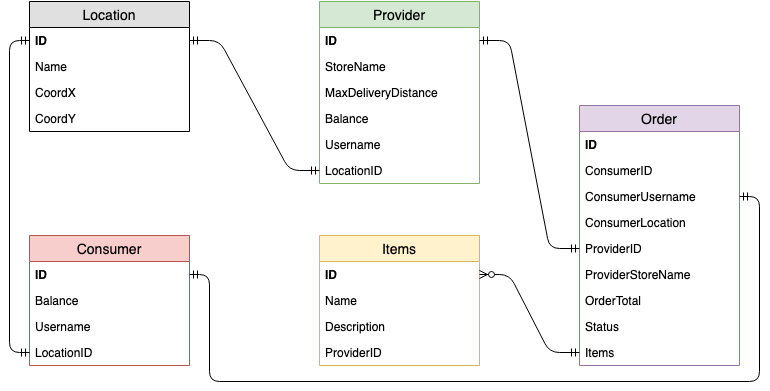

# API REST

## Indice 

1. Introducción
2. ¿Qué es una API RESTful? 
3. Nuestro Modelo 

    3.1 Herencia
    
    3.2 Base de Datos

4. Dificultades
5. Bibliografía 
6. Integrantes 

## Introducción 

En este laboratorio vamos a implementar una API RESTful para un servicio de delivery, al estilo Rappi, PedidosYA,ifood o Deliveroo. En esta API, los proveedores suben sus productos, que los consumidores pueden ver y seleccionar para incluir en un pedido. Una vez que el pedido está finalizado, la aplicación se encarga de cobrarlo al consumidor, entregarlo y pagarle al proveedor el dinero correspondiente.

1. Encapsulamiento
2. Herencia, clases abstractas y traits.
3. Sobrecarga de operadores
4. Polimorfismo

## ¿Qué es una API REST?
Una API RESTful, también conocida como servicio web RESTful,se basa en la tecnología de transferencia de estado representacional (**REST**). 

REST es cualquier interfaz entre sistemas que use HTTP para obtener datos o generar operaciones sobre esos datos en todos los formatos posibles como por ejemplo XML (en nuestro caso vamos a trabajar con JSON).

Posee muchas ventajas, entre las que se destacan más es que es un protocolo cliente/servidor ``sin estados``, cada petición HTTP contiene toda la información necesaria para ejecutarla, por lo tanto ni el cliente ni el servidor necesitan recordar ningún estado para satisfacer dicha petición.

>Las operaciones más importantes relacionadas con los datos en cualquier sistema REST son:POST (crear), GET (leer y consultar), PUT (editar) y DELETE (eliminar). En este proyecto sólo utilizamos POST y GET.

## Nuestro Modelo

### Herencia 

Al principio nosotros optamos porque todos los modelos sean "hijos" de Models incluyendo a ``User``(Consumer y Provider eran hijos de User) para simplificarnos la vida, sin embargo no tardamos mucho en darnos cuenta que esa no era la forma correcta, ya que, de dicha forma Consumer y Provider compartían la misma base de datos, por lo tanto cuando por ejemplo queríamos buscar un el nombre de un consumidor y por alguna casualidad había un proveedor con el mismo nombre nos iba a devolver el proveedor. Para solucionarlo optamos por el siguiente esquema:

Notemos que en nuestro proyecto User no es una clase normal, sino de tipo *case*, ¿A que se refiere esto?, muy simple una *case class* son como las clases normales pero con unas pequeñas diferencias. Son buenas para modelar datos **inmutables** , es decir, que no cambian. También tienen un método por defecto denominado  ``apply()`` que se encarga de la construcción del objeto.

También cabe destacar que Models no es una clase, ni siquiera una clase Abstracta, si no un *trait*. Los  trait's tienen muchas propiedade interesantes, pero la que se destaca por sobre las demas es la herencia múltiple, sin ella por ejemplo no podríamos hacer el proyecto de la forma que lo hicimos, puesto que, si vemos la imagen anterior Consumer y Provider ambos heredan de User y de Models.

En la programación orientada a objetos, la **Herencia** permite a nuevos objetos obtener las propiedades de objetos ya existentes. Una clase que es usada como la base para herencia se llama "*superclass*" o clase base y una clase que hereda de una clase base se denomina "*subclass*". Si nosotros no pudiesemos hacer esto para poder obtener todas las propiedades de la clase padre tendríamos que copiar todos los métodos y atributos que querramos en nuestra clase hijo, lo que haría que las clases tenga un tamaño grande, ya que, generalmente se le agregan nuevos métodos o atributos.

### Base de Datos

La siguiente imagen muestra como se relacionan las bases de datos de los distintos Modelos.

## Dificultades 

Una de las principales complicaciones que tuvimos al comenzar este proyecto fue habituarnos a la sintaxis de Scala, que en nuestra experiencia no se parece en nada a ningún lenguaje que hayamos visto anteriormente en la carrera.

Por otro lado fue bastante problemático acostumbrarse a trabajar con ``objetos`` desde una perspectiva funcional y numerosas veces nos veíamos tentados en utilizar la parte imperativa de Scala para por ejemplo recorrer un mapa o una lista, pero mientras más pasaba el tiempo era cada vez más fácil encarar las problemáticas que teníamos.

Además no fue fácil acostumbrarse a la forma en la que están encapsulados los objetos en Scala, debido a que, no podíamos acceder a los parámetros de forma directa y teníamos que crear nuevos métodos específicamente para obtener ciertos atributos. Sin embargo con el tiempo comprendimos que esa era la mejor forma de hacerlo y que si Scala nos permitiera hacerlo perderíamos la abstracción que nos provee la programación orientada a objetos.

Dejando de lado las dificultades del Lenguaje lo más complicado por diferencia fue entender como funcionaba **Model** , porque nunca instanciabamos dicha clase y muchas cosas más,esa y mil preguntas más tuvimos. Cada una se fue resolviendo de a poco mientras investigabamos los conceptos que necesitabamos saber. Después de esto tuvimos un error de diseño (explicado más en profuncidad en "Herencia") donde decidimos que User herede de Models, para solucionarlo no tuvimos que cambiar muchas cosas, pero si lidiamos con muchos errores al compilar.

Por último, los objetos en REST siempre se manipulan a partir de la [URI](https://stackoverflow.com/questions/176264/what-is-the-difference-between-a-uri-a-url-and-a-urn). Es la URI y ningún otro elemento el identificador único de cada recurso de ese sistema REST. La URI nos facilita acceder a la información para su modificación o borrado, o, por ejemplo, para compartir su ubicación exacta con terceros.  

## Bibliografía 

1. [RESTful API](https://searchmicroservices.techtarget.com/definition/RESTful-API)  y  [Características REST](https://bbvaopen4u.com/es/actualidad/api-rest-que-es-y-cuales-son-sus-ventajas-en-el-desarrollo-de-proyectos)
2. [Inheritance](https://www.adobe.com/devnet/actionscript/learning/oop-concepts/inheritance.html)
3. [Abstract Classes and Traits](https://www.geeksforgeeks.org/difference-between-traits-and-abstract-classes-in-scala/)

## Integrantes 
* Gonzalo Gigena 
* Leandro Acosta 
* Christian Moreno
